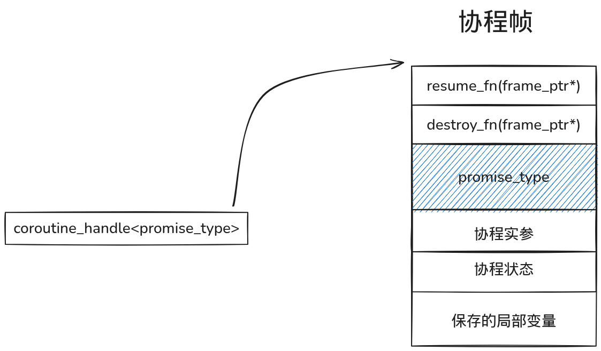

- [软件线程](#软件线程)
  - [引入](#引入)
  - [内核态](#内核态)
    - [内核线程是什么？](#内核线程是什么)
  - [用户态](#用户态)
    - [pthreads](#pthreads)
    - [实现用户态线程](#实现用户态线程)
    - [协程](#协程)
      - [C++20 Coroutine](#c20-coroutine)
      - [Rust Async](#rust-async)
- [硬件线程](#硬件线程)
  - [前言](#前言)
  - [GPGPU](#gpgpu)
  - [SIMT](#simt)
- [总结](#总结)


~~线程（英语：thread）在计算机科学中，是将进程划分为两个或多个线程（实例）或子进程，由单处理器（单线程）或多处理器（多线程）或多核处理系统并发执行。~~(维基百科)

省流：线程是**独立的控制流状态**


## 软件线程

### 引入

现代操作系统需要运行各种各样的程序，为了管理这些程序的运行，操作系统提出了进程的抽象。每个进程都对应于一个运行的程序，有了这种抽象后，程序运行时可以认为自己独占了整个CPU，不需要考虑其他程序的运行状况，而物理资源的分配交给操作系统负责。具体实现上，操作系统通过上下文切换 (保存和恢复进程在运行时的状态)机制实现了进程的暂停、切换和恢复，从而实现了CPU资源的共享，为程序提供了虚拟化的环境。

随着计算机的发展，CPU的数量不断增加，应用程序的需求也越来越复杂。有些程序希望同时利用多个CPU来加速计算，但传统的进程由于独立的地址空间和较高的通信开销，难以高效实现这种并行。为了解决这个问题，操作系统引入了线程的概念。线程是比进程更轻量级的执行单位，同一进程内的多个线程共享进程的地址空间和大部分资源，使得线程之间的通信和切换开销更低。在多核对称多处理（SMP）架构下，多个线程可以被调度到不同的CPU核心上真正并行运行，从而显著提高程序的性能和资源利用率。通过线程，操作系统不仅提供了更灵活的并发模型，也让应用程序能够更充分地利用现代多核计算机的计算能力。

### 内核态
#### 内核线程是什么？
Linux内核把进程称为任务(task)，进程的虚拟地址空间分为用户虚拟地址空间和内核虚拟地址空间，所有进程共享内核虚拟地址空间，每个进程有独立的用户虚拟地址空间，这意味着进程其实是用户态的概念，不存在内核进程，内核只有内核线程，且无用户虚拟地址空间，来看看代码

```
struct task_struct {
  unsigned int			__state;
  void				*stack;
  pid_t				pid;
  pid_t				tgid;
  struct mm_struct		*mm;
  struct mm_struct		*active_mm;
  ......
}
```
进程的mm和active_mm指向同一个mm_struct，对于内核线程，mm是nullptr，当内核线程运行时，active_mm指向从进程借来的mm_struct

在内核中只有task这个概念，只有task才能被调度运行,而用户态是没有权限创建全新的task的，只能通过系统调用去clone当前进程的task，线程只是从进程的task中clone出来的另一个task,所以线程会和进程共享资源,所以进程和线程都是task只是某些属性不同

~~想创建内核线程的话可以写内核模块，代码运行在内核态~~

在高级编程语言中全部创建线程的行为都是调用了一个线程库，最终会调用到clone()这种系统调用上，常说的多线程模型指的就是用户态线程库的策略

### 用户态
#### pthreads
如果每个人都用clone去编写多线程程序那就太麻烦了，于是有了线程库，线程库为应用提供了创建，退出，合并等操作线程的接口。

线程库在用户态实现了线程控制块（TCB），这个是作为内核中task的扩展而存在的，编程语言中的threadlocal变量/线程本地存储（TLS）功能就是通过这个实现的，以x86-64为例（Linux平台），当一个线程被调度时，pthread会找到该线程TLS的起始地址，存入段寄存器FS中，当线程访问TLS中的变量时，会用FS中的值加上偏移量的方式获取变量。

#### 实现用户态线程
(*示例来自cfsamson的200行Rust代码实现绿色线程*)

(*不是线程库，不会用clone的，需要一点基础,~~非常简单~~*)

(~~ABI相关的东西就不展开说了~~)
```
#![feature(naked_functions)]

use std::arch::{global_asm, naked_asm};
use std::sync::atomic::{AtomicUsize, Ordering};

/// Default stack size for green thread
const DEFAULT_STACK_SIZE: usize = 1024 * 1024 * 2;
/// Max threads for user tasks running
const MAX_THREADS: usize = 4;

/// Pointer to our runtime, we're only setting this variable on initialization
static mut RUNTIME: usize = 0;

/// Runtime schedule and switch threads
pub struct Runtime {
    threads: Vec<Thread>,
    // the id of the currently running thread
    current: usize,
}

/// Green thread
struct Thread {
    id: usize,
    stack: Vec<u8>,
    ctx: ThreadContext,
    state: State,
}

/// Thread state
#[derive(PartialEq, Eq, Debug)]
enum State {
    // ready to be assigned a task if needed
    Available,
    // running
    Running,
    // ready to move forward and resume execution
    Ready,
}

#[derive(Debug, Default)]
#[repr(C)]
pub struct ThreadContext {
    // return address
    ra: u64,
    // stack pointer
    sp: u64,
    // s0 - s11 (callee saved registers)
    s0: u64,
    s1: u64,
    s2: u64,
    s3: u64,
    s4: u64,
    s5: u64,
    s6: u64,
    s7: u64,
    s8: u64,
    s9: u64,
    s10: u64,
    s11: u64,
    // task entry
    entry: u64,
}

impl Thread {
    fn new(id: usize) -> Self {
        Thread {
            id,
            stack: vec![0_u8; DEFAULT_STACK_SIZE],
            ctx: ThreadContext::default(),
            state: State::Available,
        }
    }

    fn new_with_state(id: usize, state: State) -> Self {
        Thread {
            id,
            stack: vec![0_u8; DEFAULT_STACK_SIZE],
            ctx: ThreadContext::default(),
            state,
        }
    }
}

impl Runtime {
    pub fn new() -> Self {
        // Base thread is for runtime running
        let base_thread_id = 0;
        let base_thread = Thread::new_with_state(base_thread_id, State::Running);

        // These threads are for user tasks running
        let mut threads = vec![base_thread];
        let mut available_threads = (1..MAX_THREADS + 1).map(|i| Thread::new(i)).collect();
        threads.append(&mut available_threads);

        Runtime {
            threads,
            current: base_thread_id,
        }
    }

    /// This is cheating a bit, but we need a pointer to our Runtime
    /// stored so we can call yield on it even if we don't have a
    /// reference to it.
    pub fn init(&self) {
        unsafe {
            let r_ptr: *const Runtime = self;
            RUNTIME = r_ptr as usize;
        }
    }

    /// Start running our `Runtime`. It will continually call `t_yield()` until
    /// it returns false which means that there is no more work to do.
    pub fn run(&mut self) {
        while self.t_yield() {}
        println!("All tasks finished!");
    }

    /// User tasks call this function to return and schedule a new thread to be run
    fn t_return(&mut self) {
        // Mark current thread available, so it can be assigned a new task
        self.threads[self.current].state = State::Available;

        self.t_schedule();
    }

    /// Suspend current thread and schedule a new thread to be run
    fn t_yield(&mut self) -> bool {
        // Mark current thread ready, so it can be scheduled again
        self.threads[self.current].state = State::Ready;

        self.t_schedule()
    }

    /// Schedule a new thread to be run
    fn t_schedule(&mut self) -> bool {
        let thread_count = self.threads.len();

        // Find next ready thread
        let mut pos = (self.current + 1) % thread_count;
        while self.threads[pos].state != State::Ready {
            pos = (pos + 1) % thread_count;

            // If no other ready thread, means all user tasks finished
            // so current thread must be base thread
            if pos == self.current {
                return false;
            }
        }
        println!("RUNTIME: schedule next thread {} to be run", pos);

        // Switch to a new thread
        self.threads[pos].state = State::Running;
        let old_pos = self.current;
        self.current = pos;
        unsafe {
            switch(&mut self.threads[old_pos].ctx, &self.threads[pos].ctx);
        }

        true
    }

    /// Spawn a new task to be executed by a green thread in runtime
    pub fn spawn(&mut self, f: fn()) {
        let available = self
            .threads
            .iter_mut()
            .find(|t| t.state == State::Available)
            .expect("no available green thread.");

        println!("RUNTIME: spawning task on green thread {}", available.id);
        let size = available.stack.len();
        unsafe {
            let s_ptr = available.stack.as_mut_ptr().offset(size as isize);

            // make sure our stack itself is 8 byte aligned,
            // risc-v ld/sd instructions need address 8 byte alignment
            let s_ptr = (s_ptr as usize & !7) as *mut u8;

            available.ctx.ra = task_return as u64; // task return address
            available.ctx.sp = s_ptr as u64; // stack pointer
            available.ctx.entry = f as u64; // task entry address
        }
        available.state = State::Ready;
    }
}

/// When user task completed, then will jump to this function to return
fn task_return() {
    unsafe {
        let rt_ptr = RUNTIME as *mut Runtime;
        (*rt_ptr).t_return();
    }
}

/// Call yield from an arbitrary place in user task code
pub fn r#yield() {
    unsafe {
        let rt_ptr = RUNTIME as *mut Runtime;
        (*rt_ptr).t_yield();
    };
}

/// We could use naked function to implement switch function
#[naked]
#[no_mangle]
unsafe extern "C" fn switch(old: *mut ThreadContext, new: *const ThreadContext) {
    // a0: old, a1: new
    naked_asm!(
        "
        sd ra, 0*8(a0)
        sd sp, 1*8(a0)
        sd s0, 2*8(a0)
        sd s1, 3*8(a0)
        sd s2, 4*8(a0)
        sd s3, 5*8(a0)
        sd s4, 6*8(a0)
        sd s5, 7*8(a0)
        sd s6, 8*8(a0)
        sd s7, 9*8(a0)
        sd s8, 10*8(a0)
        sd s9, 11*8(a0)
        sd s10, 12*8(a0)
        sd s11, 13*8(a0)
        // When user task scheduled for the second time,
        // overwrite task entry address with the return address
        sd ra, 14*8(a0)

        ld ra, 0*8(a1)
        ld sp, 1*8(a1)
        ld s0, 2*8(a1)
        ld s1, 3*8(a1)
        ld s2, 4*8(a1)
        ld s3, 5*8(a1)
        ld s4, 6*8(a1)
        ld s5, 7*8(a1)
        ld s6, 8*8(a1)
        ld s7, 9*8(a1)
        ld s8, 10*8(a1)
        ld s9, 11*8(a1)
        ld s10, 12*8(a1)
        ld s11, 13*8(a1)
        // When user task scheduled for the first time, t0 will be task entry address.
        // After that, t0 will be return address
        ld t0, 14*8(a1)

        // pseudo instruction, actually is jalr x0, 0(t0)
        jr t0
    "
    );
}


static FINISHED_TASK_COUNT: AtomicUsize = AtomicUsize::new(0);

fn main() {
    let mut runtime = Runtime::new();
    runtime.init();
    runtime.spawn(|| {
        test_task(1);
    });
    runtime.spawn(|| {
        test_task(2);
    });
    runtime.spawn(|| {
        test_task(3);
    });
    runtime.run();
    assert_eq!(FINISHED_TASK_COUNT.load(Ordering::SeqCst), 3);
}

fn test_task(task_id: usize) {
    println!("TASK {} STARTING", task_id);
    for i in 0..4 * task_id {
        println!("task: {} counter: {}", task_id, i);
        r#yield();
    }
    FINISHED_TASK_COUNT.fetch_add(1, Ordering::SeqCst);
    println!("TASK {} FINISHED", task_id);
}
```
值得注意的点在于switch的逻辑以及spawn时线程的上下文的ra被设置为函数task_return的地址，当线程被调度时，上下文存储的ra会被恢复到寄存器上，线程的结束必然回到调度逻辑上且因为状态改变这个线程不会再被调度，这个线程始终走不到switch后返回true的逻辑

(~~看不懂的话需要熟悉下基础的汇编,示例为RISC-V~~)

#### 协程
在我看来，只要是描述`task`的就都是标题所指的`线程`，自然也要讨论讨论`协程`了

实际上刚才实现的用户态线程就是有栈协程，他有整个调用栈。而无栈协程只是个根据状态选择不同分支的函数，没有调用栈，常说的无栈协程高性能就来自不需要调用栈节省内存以及协程上下文极小切换没什么开销(就是个状态而已)

(*由于本人掌握的编程语言较少，只能讨论cpp和rust的无栈协程了*)

换句话说，协程只是可以挂起和恢复的函数

函数只有2个行为：调用和返回，函数返回后，栈上所拥有的状态会被全部销毁，协程则可以挂起，协程挂起时可以保留协程上下文，恢复则恢复协程的上下文，协程的上下文取决于协程内的局部变量等，当协程像函数一样返回，协程也要被销毁
##### C++20 Coroutine
c++的协程展开后和以下代码的逻辑类似

（这是伪代码，实际ABI各厂商可以自由实现）
```
enum State {
    Start,
    YieldValue,
    FinalSuspend,
    Done
};

struct CoroutineStateMachine {
    State current_state = Start; 
    int a = 1, b = 1;          //  

    // promise_type的引用，协程的promise接口
    promise_type& promise;

    void resume() {
        try {
            switch (current_state) {
                case Start:
                    // 执行 initial_suspend
                    if (promise.initial_suspend()) {
                        current_state = YieldValue;
                        return;  // 挂起
                    }
                    // 进入协程主体
                    [[fallthrough]];

                case YieldValue:
                    while (a < 1000000) {
                        // co_yield a
                        promise.yield_value(a);
                        current_state = YieldValue;
                        std::tie(a, b) = std::make_tuple(b, a + b);
                        return;  // 挂起
                    }
                    // co_return
                    promise.return_void();
                    current_state = FinalSuspend;
                    [[fallthrough]];

                case FinalSuspend:
                    // 执行 final_suspend
                    if (promise.final_suspend()) {
                        current_state = Done;
                        return;  // 挂起
                    }
                    // 结束
                    [[fallthrough]];

                case Done:
                    return;  // 协程结束
            }
        } catch (...) {
            // 异常处理
            if (!promise.initial_await_resume_called()) {
                promise.unhandled_exception();
            }
        }
    }
};

```
先来认识一下协程帧，

创建协程就是创建协程帧，其中promise类型需要用户定义，其他的编译器会帮你做好，一般来说，整个协程会放在堆内存上

协程的调用者会得到来自promise_type结构体内get_return_object方法返回的对象，这里一般通过form_promise构造协程句柄 `coroutine_handle<promise_type>`，调用者可以通过协程句柄resume协程和destroy协程

得到协程的句柄后，它可以被传递到其他地方，例如产生一个普通的函数调用，并传递给它进行后续协程的恢复操作

在协程的恢复过程中，恢复者调用协程句柄的resume()函数，如上面代码所示，它就是一个普通的函数调用，会将控制流会转交给协程。

在协程内部，它可以选择挂起或返回动作，通过C++20引入三个新的关键字实现：co_await、co_yield和co_return。只要函数存在这三个中的任意一个关键字，它便被当成协程处理。

说这些肯定还是一头雾水(~~其实也没打算教会谁就是了~~)，理解协程需要理解Promise和Awaitable,这两个都是用户自定义的类型.

Promise类型能够让用户定制一个协程的调用、返回行为，以及协程体内的co_await与co_yield表达式的行为。

Awaitable类型能够让用户定制co_await表达式的语义，co_await接受一个Awaitable对象，该对象能够控制当前协程是否挂起，挂起后需要执行哪些逻辑供将来恢复，以及恢复后如何产生该表达式的值

由浅入深，先从创建协程帧开始
```
#include <coroutine>
#include <iostream>

struct MyPromise {
    std::suspend_always initial_suspend() { return {}; }
    std::suspend_never final_suspend() noexcept { return {}; }
    void return_void() {}
    void unhandled_exception() { std::terminate(); }

    std::coroutine_handle<MyPromise> get_return_object() {
        return std::coroutine_handle<MyPromise>::from_promise(*this);
    }
};

std::coroutine_handle<MyPromise> myCoroutine() {
    std::cout << "Coroutine started\n";
    std::cout << "Coroutine ended\n";
    co_return;
}

int main() {
    auto handle = myCoroutine();
    std::cout << "Coroutine created, not started yet\n";
    handle.resume();
    handle.destroy();
    return 0;
}
```
协程帧里是需要promise类型的，通过将promise类型传递给句柄类型以让编译器生成正确的协程帧，`initial_suspend`的返回类型为std::suspend_always表示协程创建完立马挂起，所以我们需要使用句柄手动resume才能将控制流转交给协程，resume会根据当前状态选择正确的分支路径，可以参考最开始给出的伪代码，最后会执行到co_return，这标志着协程已经执行完了，如伪代码所示，他会调用promise定义的相关行为，最后改变状态表示协程已经进入结束状态，最后调用`final_suspend`决定还要不要挂起协程

而控制协程挂起的就是awaiter，为了体现awaiter的作用，代码扩展为
```
#include <coroutine>
#include <iostream>

struct MyAwaiter {
    bool await_ready() const noexcept { return false; }
    void await_suspend(std::coroutine_handle<> h) const noexcept {
        std::cout << "Coroutine suspended!\n";
    }
    void await_resume() const noexcept {
        std::cout << "Coroutine resumed!\n";
    }
};

struct MyPromise {
    std::suspend_always initial_suspend() { return {}; }
    std::suspend_never final_suspend() noexcept { return {}; }
    void return_void() {}
    void unhandled_exception() { std::terminate(); }

    std::coroutine_handle<MyPromise> get_return_object() {
        return std::coroutine_handle<MyPromise>::from_promise(*this);
    }
};

std::coroutine_handle<MyPromise> myCoroutine() {
    std::cout << "Coroutine started\n";
    co_await MyAwaiter{};
    std::cout << "Coroutine ended\n";
    co_return;
}

int main() {
    auto handle = myCoroutine();
    std::cout << "Coroutine created, not started yet\n";
    handle.resume();
    handle.resume();
    handle.destroy();
}
```
co_await需要接一个awaiter对象，其实不是awaiter也行，因为会自动转换，编译器会检查携程用户定义的promise对象是否存在await_transform,如果存在，那么awaiter对象就是await_transform返回的那个，通过这一步得到awaiter/awaitable后，检查该对象是否重载了operator co_await()操作符，如果重载则使用该函数调用后的结果作为最终的Awaiter对象

awaiter需要实现三个接口
- await_ready,判断当前携程是否需要在此挂起
- await_suspend， 接受当前协程的句柄，用户爱用这个句柄干嘛都行
- await_resume，当前协程恢复时，其返回值将作为整个co_await表达式的值

其中await_suspend有3个版本，通过返回类型区分
- 返回类型为void，则直接返回给当前协程的调用者或恢复者。
- 返回类型为bool，如果返回true，则挂起当前协程并返回给当前协程的调用者或恢复者，否则直接恢复当前协程
- 返回类型为coroutine_handle，则挂起当前协程并返回给当前协程的调用者或恢复者，随即恢复它所返回的协程句柄,也就是挂起当前resume另一个（*印象中rust是做不到这种操作的*）

编译器会将`auto result = co_await awaiter;`展开为类似
```
if (!awaiter_object.await_ready()) {
    awaiter_object.await_suspend(coroutine_handle);
    return; // 协程挂起
}
auto result = awaiter_object.await_resume();  
```
的片段，这保证了resume回来后总能执行到awaiter的await_resume


而co_yield则是
```
auto awaiter_object = promise.yield_value(expr);   // yield_value 返回 awaiter
if (!awaiter_object.await_ready()) {
    awaiter_object.await_suspend(coroutine_handle);
    return; // 协程挂起
}
auto result = awaiter_object.await_resume();               
```

再次调用到了promise，可以将co_yield后接的值传递给promise，co_return也是类似的，就不再列举出来了

实际上std::suspend_never和std::suspend_always也都是awaiter

总之，在协程里写的各种局部变量会被放在堆上，而协程想要将结果返回给调用者也都走promise，将结果写进promise的某个字段，调用者拥有句柄，句柄可访问promise，各种各样的挂起逻辑靠co_await和awaiter

##### Rust Async
(~~不会rust,瞎说的，有错误请纠正~~)
rust的协程设计上和cpp完全不同，个人理解是c++只需要理解编译器怎么生成协程就好了，爱怎么用怎么用，拿到句柄玩一堆UB都行，rust却完整规定了一种编程模式

(~~rust本来就没称呼这个为协程~~)

除了手动实现future trait(*嵌套的future最终总会poll一个手动实现的future*), rust中每一个async函数都会自动生成并返回一个future对象，通过future trait可以看到是通过poll来执行协程内代码以及状态切换，这里贴一下tokio教学文档里的例子

```
impl Future for MainFuture {
    type Output = ();

    fn poll(mut self: Pin<&mut Self>, cx: &mut Context<'_>)
        -> Poll<()>
    {
        use MainFuture::*;

        loop {
            match *self {
                State0 => {
                    let when = Instant::now() +
                        Duration::from_millis(10);
                    let future = Delay { when };
                    *self = State1(future);
                }
                State1(ref mut my_future) => {
                    match Pin::new(my_future).poll(cx) {
                        Poll::Ready(out) => {
                            assert_eq!(out, "done");
                            *self = Terminated;
                            return Poll::Ready(());
                        }
                        Poll::Pending => {
                            return Poll::Pending;
                        }
                    }
                }
                Terminated => {
                    panic!("future polled after completion")
                }
            }
        }
    }
}

```
通过executor去poll这些future,executor需要为这些future提供waker,并用waker构造context,这样在pending时就可以通过传入的context拿到waker,并用waker将自己重新加入调度队列中


```
use std::future::Future;
use std::pin::Pin;
use std::task::{Context, Poll, RawWaker, RawWakerVTable, Waker};


fn dummy_raw_waker() -> RawWaker {
    fn clone(_: *const ()) -> RawWaker { dummy_raw_waker() }
    fn wake(_: *const ()) {}
    fn wake_by_ref(_: *const ()) {}
    fn drop(_: *const ()) {}

    RawWaker::new(std::ptr::null(), &RawWakerVTable::new(
        clone,
        wake,
        wake_by_ref,
        drop,
    ))
}

fn dummy_waker() -> Waker {
    unsafe { Waker::from_raw(dummy_raw_waker()) }
}

fn block_on<F: Future>(mut fut: F) -> F::Output {
    let waker = dummy_waker();
    let mut cx = Context::from_waker(&waker);
    let mut fut = unsafe { Pin::new_unchecked(&mut fut) };

    loop {
        match fut.as_mut().poll(&mut cx) {
            Poll::Ready(val) => return val,
            Poll::Pending => {
                // 在真正的 executor 中，这里会等待事件
                // 我们的 dummy executor 不会等待，所以继续 poll
            }
        }
    }
}


async fn hello() -> i32 {
    println!("Hello inside coroutine!");
    42
}

fn main() {
    let result = block_on(hello());
    println!("Result = {}", result);
}

```
block_on就是承担的executor的责任，真正的异步运行时的话会有自己的任务队列，会不断消费队列中的任务

```
async fn foo() -> i32 {
    let x = future.await;
    x + 1
}

```
rust中.await会变成对其future的poll，如以下伪代码
```
loop {
    match Pin::new(&mut future).poll(cx) {
        Poll::Ready(v) => {
            x = v;
            break;
        }
        Poll::Pending => {
            return Poll::Pending;  // suspend！
        }
    }
}

```
其中context来自父层future被executor执行poll时传入的context

而waker是让任务在异步事件完成后能被执行器重新 poll 的机制
```
pub struct RawWaker {
    data: *const (),
    vtable: &'static RawWakerVTable,
}

pub struct RawWakerVTable {
    clone: fn(*const ()) -> RawWaker,
    wake: fn(*const ()),
    wake_by_ref: fn(*const ()),
    drop: fn(*const ()),
}

```
其中data指向执行器内部保存的 “任务结构”，RawWakerVTable规定了如何wake,clone,drop

最简单的wake就是将任务重新放回任务队列，后续executor在Loop消费任务的时候自然就又poll回来了

主题也不是异步编程，就不深入说了

## 硬件线程
总算把软件部分水完了，实际上我也早忘了上面那些玩意，重新翻了资料才凑出来的
### 前言
在开始之前需要先了解一下Flynn 分类法，

根据 **指令流** 和 **数据流** 的数量对计算机体系结构进行分类：

| 类型 | 全称 | 含义 | 示例 |
|------|------|------|------|
| **SISD** | Single Instruction, Single Data | 单指令流、单数据流；顺序执行的标量处理器 | 传统单核 CPU |
| **SIMD** | Single Instruction, Multiple Data | 单指令流、多数据流；同一指令并行处理多组数据 | GPU、AVX/NEON 指令集 |
| **MISD** | Multiple Instruction, Single Data | 多指令流、单数据流；理论结构，实际少见 | 容错系统（流水线冗余） |
| **MIMD** | Multiple Instruction, Multiple Data | 多指令流、多数据流；多核或分布式并行系统 | 多核 CPU、集群、超级计算机 |

硬件多线程就是和MIMD密切相关的概念，MIMD并没规定指令流与处理器功能单元之间的关系，自然可以想到通过共享功能单元来执行不同指令流以有效利用硬件资源，为了支持这种共享，处理器必须复制每个指令流的独立状态。例如，每个指令流都需要独立的程序计数器以及寄存器堆。

在上面，我们都是通过软件实现的类似功能，硬件多线程就是硬件支持的在线程间快速切换的能力


额外提一下每个人都在使用的`同时多线程`，就是超线程技术，使用lscpu可以查看指标`Thread(s) per core`,大于1就是用了同时多线程

同时多线程使用多发射，动态调度流水线的处理器资源来挖掘线程级并行和指令级并行，消费级的cpu使用同时多线程只是为了不浪费功能单元，没什么隐藏延迟的能力

### GPGPU
众所周知CPU就那点线程数，而GPU却能开出成千上万的线程数,CPU是不是拉完了？实际上二者并不等价

CPU设计为面向延迟，GPU设计为面向吞吐，在大规模数据并行计算上，GPU有着天然的优势，就好比一辆轿车和一辆公交车，可以想象一下公交站来的是轿车那么运送全部乘客需要花多久，游戏渲染也是大规模数据并行计算，所以打游戏需要好的GPU

自2006年，NVIDIA公布了统一着色器架构，GPU就进入了通用计算时代，在大规模数据并行处理问题上，GPGPU可以提供CPU无可比拟的速度，由于其通用性，当下火热的AI也适合在GPGPU上计算，更何况各家都在往GPGPU里加入更适合AI计算的功能单元

### SIMT
GPGPU本质上也是一种SIMD向量处理器，但NV另外为其定义了新名字：SIMT,由于在具体实现上与先前的SIMD概念并不一致，于是人们接受了这个说法。SIMT一方面十分契合GPU体系结构，另一方面又贴合程序员的思维习惯，这使得SIMT成功推广开，成为GPU上标准的编程模型(前几天NV又公布了Tile IR, 这是异于SIMT的全新编程模型，但主要是服务于张量核心的，与当前讨论的向量无关)

在原来的SIMD向量处理器中，一条指令可以处理一个向量，但控制逻辑仍然是通过与通用处理器相同的方式来完成的，即借用标量计算来维护循环条件，然后使用条件分支跳转指令来构成分支或循环控制流。在SIMD向量处理器上，一条指令流仍然对应着一条控制流，即使计算过程很明显是并行的，但人们还是会认为整个向量处理器上只运行了一个线程。SIMT不再将指令流视作线程，而是允许处理器中构成向量的每一个单独运算单元都能够执行自己的线程，这是因为在GPU上每个运算单元都允许有自己独立的控制流。在编写SIMT程序时，程序员专注于控制众多运算器中的一个，并如同控制通用处理器一样去编写正常的分支、循环控制结构；GPU上全部运算器都将遵循相同的程序一同执行

在传统的SIMD中遇到分支一般会执行全部路径，最后靠掩码分发不同路径的结果，但NV却是先关闭不符合当前路径的线程，然后执行这个分支，其他分支同理，在`Volta`架构引入独立线程程序计数器之前一直是这样的，可以认为GPU的线程数只是SIMD中数据流的宽度，引入之后这个概念就越发模糊了,因为每个线程都有自己的程序计数器等状态，虽然仍然不意味着不同分支能同时运行

以下是一段SIMT编程模型的代码，风格为 `Scalar Program, Blocked Threads`，通过threadIdx得知自己是哪一个线程，实现上，保存线程信息的寄存器是特殊寄存器，程序描述的仍然是标量，但会启动成百上千的线程去执行这段代码
```
template<int const BLOCKSIZE>
__global__ void sgemm_shared_mem_block(int M, int N, int K, float alpha,
                                       float const *A, float const *B,
                                       float beta, float *C) {
    uint const cRow = blockIdx.x;
    uint const cCol = blockIdx.y;

    __shared__ float As[BLOCKSIZE * BLOCKSIZE];
    __shared__ float Bs[BLOCKSIZE * BLOCKSIZE];

    uint const threadCol = threadIdx.x % BLOCKSIZE;
    uint const threadRow = threadIdx.x / BLOCKSIZE;

    A += cRow * BLOCKSIZE * K;
    B += cCol * BLOCKSIZE;
    C += cRow * BLOCKSIZE * N + cCol * BLOCKSIZE;

    float tmp = 0.0;
    for (int bkIdx = 0; bkIdx < K; bkIdx += BLOCKSIZE) {
        As[threadRow * BLOCKSIZE + threadCol] = A[threadRow * K + threadCol];
        Bs[threadRow * BLOCKSIZE + threadCol] = B[threadRow * N + threadCol];

        __syncthreads();
        A += BLOCKSIZE;
        B += BLOCKSIZE * N;
#pragma unroll
        for (int dotIdx = 0; dotIdx < BLOCKSIZE; ++dotIdx) {
            tmp += As[threadRow * BLOCKSIZE + dotIdx] *
                    Bs[dotIdx * BLOCKSIZE + threadCol];
        }
        __syncthreads();
    }
    C[threadRow * N + threadCol] =
            alpha * tmp + beta * C[threadRow * N + threadCol];
}

```
说一句题外话，如果要快速适应智能计算的需求，最合适的编程模型是按Tile划分数据，编译器自动分配线程，这是因为当下的GPU塞了太多AI计算需要的东西了，而AI需要的计算一般描述数据为张量，同向量处理器和标量处理器的关系，张量不会更通用，但特定任务下会很好用，前几天NV公布了完全不同于SIMT风格虚拟指令集PTX的Tile IR，以下是官方的介绍

Unlike PTX, which models the GPU as a data-parallel single instruction multiple thread (SIMT) processor, Tile IR models the GPU as a tile-based processor. In Tile IR, each logical thread (tile block) computes over partial fragments (tiles) of multi-dimensional arrays (tensors).

如果要挖掘理论性能，还是需要PTX的，这是体系结构决定的，如果是为了快速适应智能计算的需要，Tile IR会更好

## 总结

不管软件还是硬件都指明，线程是**独立的控制流状态**

(参考了大量资料，如果觉得某段话眼熟，那肯定是我摘抄过来了)
